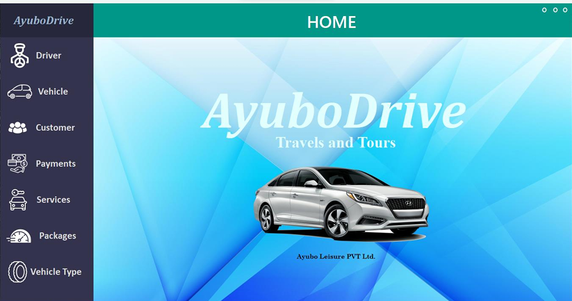
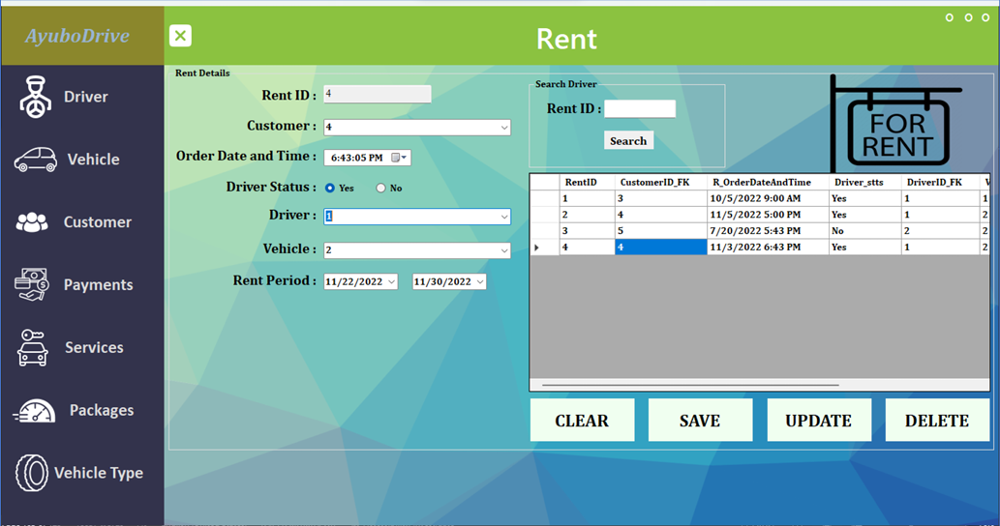
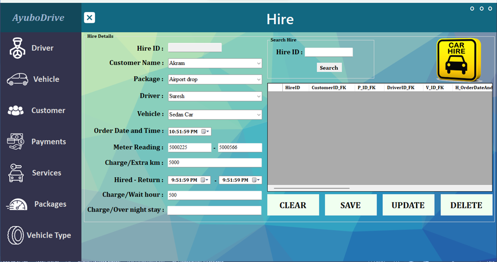

# Ayubo Drive Vehicle Rental & Hire System

## Project Overview

Ayubo Drive, a transport arm of Ayubo Leisure (Pvt) Ltd, offers a fleet of vehicles for rent and hire in Sri Lanka. This application helps manage vehicle rentals, hires, and calculations for different vehicle types and packages.

  

## Features

### Rent Calculation
- **Function 1**: Calculate the total rent based on vehicle number, rental dates, and whether the vehicle is with or without a driver.

  

### Day Tour Hire Calculation
- **Function 2**: Calculate the hire amount for day tours, considering package type, start and end times, and distance traveled.

### Long Tour Hire Calculation
- **Function 3**: Calculate the hire amount for long tours, including base charges, overnight stay charges, and extra distance charges.

  

## Technologies Used
- **Language**: C#
- **Framework**: .NET
- **IDE**: Visual Studio
- **Database**: SQL Server

## Getting Started
1. Clone the repository: `git clone https://github.com/your-username/ayubo-drive-car-rental-system.git`
2. Open the project in Visual Studio.
3. Restore the NuGet packages.
4. Set up the database connection in the configuration file.
5. Run the application.

## License
This project is licensed under the MIT License - see the [LICENSE](LICENSE) file for details.
